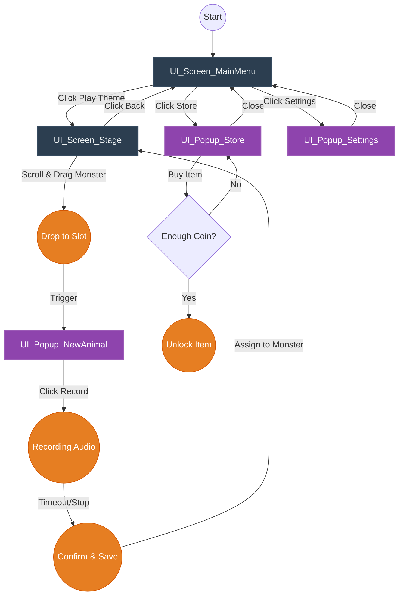

# Monster-vox UX Wireframes & Flow

## 1. UX Flowchart (Mermaid)



## 2. ASCII Wireframes

### Màn hình Sảnh Chính (`UI_Screen_MainMenu`)
```text
+---------------------------------------+
|                 HOME                  |
|                                       |
|  [Coin_Icon] 1500      [Settings_Btn] |
|---------------------------------------|
|                                       |
|                                       |
|          <   [ Theme 1 ]   >          |
|                (Image)                |
|                                       |
|                                       |
|           +---------------+           |
|           |  PLAY THEME   |           |
|           +---------------+           |
|                                       |
|                                       |
|---------------------------------------|
|  [ Btn_Store ]      [ Btn_Collection ]|
+---------------------------------------+
```

### Màn hình Sân Khấu (`UI_Screen_Stage`)
```text
+---------------------------------------+
|  [Btn_Back]                   (0 Coins) |
|---------------------------------------|
| [Mon1] |                              |
| [150$] |                              |
|--------|                              |
| [Mon2] |     [Slot 1]    [Slot 2]     |
| [Unlock]     (Empty)     (Empty)      |
|--------|                              |
| [Mon3] |                              |
| [Open] |     [Slot 3]                 |
|--------|     (Empty)                  |
| [Mon4] |                              |
| [150$] |                              |
+---------------------------------------+
```

### Popup New Animal (`UI_Popup_NewAnimal`)
```text
+---------------------------------------+
|  +---------------------------------+  |
|  |           NEW ANIMAL            |  |
|  |---------------------------------|  |
|  |           [ Portrait ]          |  |
|  |           [ InputName]          |  |
|  |                                 |  |
|  |            Timer 00:02          |  |
|  |                                 |  |
|  |        [  Btn Record  ]         |  |
|  |                                 |  |
|  |   [Try Again] [Play] [Confirm]  |  |
|  +---------------------------------+  |
+---------------------------------------+
```

### Popup Cửa Hàng (`UI_Popup_Store`)
```text
+---------------------------------------+
|  +---------------------------------+  |
|  |             STORE         [X]   |  |
|  |---------------------------------|  |
|  | [Themes] [Monsters] [Slots]     |  |
|  |---------------------------------|  |
|  |                                 |  |
|  |  +-------+           +-------+  |  |
|  |  | Th_1  |           | Th_2  |  |  |
|  |  | [0 C] |           | [Lock]|  |  |
|  |  +-------+           +-------+  |  |
|  |                                 |  |
|  |  +-------+           +-------+  |  |
|  |  | Mon_2 |           | Mon_3 |  |  |
|  |  | [150] |           | [300] |  |  |
|  |  +-------+           +-------+  |  |
|  |                                 |  |
|  |---------------------------------|  |
|  |                                 |  |
|  +---------------------------------+  |
+---------------------------------------+
```

### Popup Cài Đặt (`UI_Popup_Settings`)
```text
+---------------------------------------+
|  +---------------------------------+  |
|  |            SETTINGS       [X]   |  |
|  |---------------------------------|  |
|  |                                 |  |
|  |  BGM:    [========|      ]      |  |
|  |                                 |  |
|  |  SFX:    [===========|   ]      |  |
|  |                                 |  |
|  |  Vocal:  [=====|         ]      |  |
|  |                                 |  |
|  |---------------------------------|  |
|  |                                 |  |
|  |                                 |  |
|  |         [ Tutorial ]            |  |
|  |                                 |  |
|  +---------------------------------+  |
+---------------------------------------+
```
